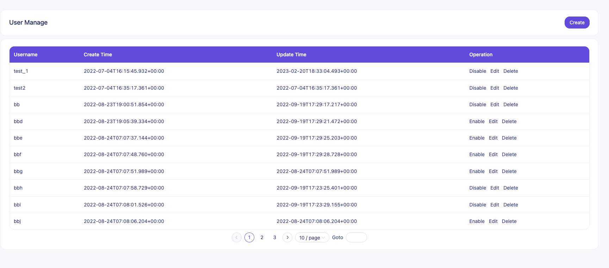
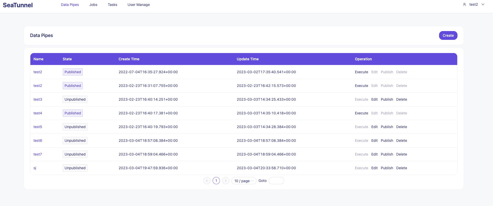
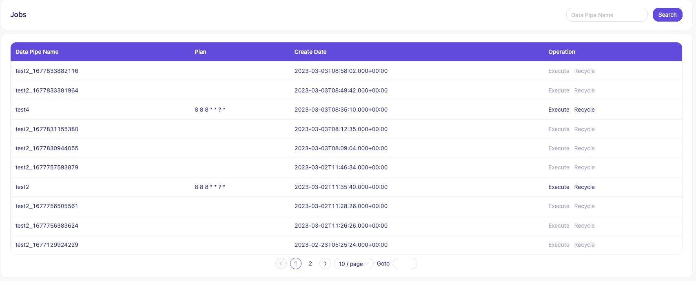
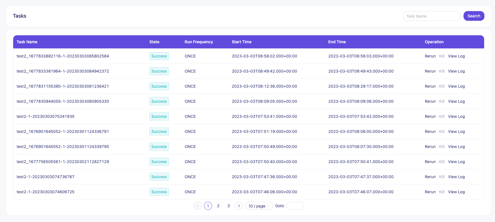

# Apache SeaTunnel (Incubating)


[](https://github.com/apache/incubator-seatunnel/actions/workflows/backend.yml)
[](https://join.slack.com/t/apacheseatunnel/shared_invite/zt-123jmewxe-RjB_DW3M3gV~xL91pZ0oVQ)
[](https://twitter.com/ASFSeaTunnel)

---
[](README.md)

SeaTunnel was formerly named Waterdrop , and renamed SeaTunnel since October 12, 2021.

---

So, What we are?

An open-source web console to manage your seatunnel-script, and would push them to any scheduling-system easily.
Click it if your want to know more about our design. 👉🏻[Design](https://github.com/apache/incubator-seatunnel/issues/1947)


## How to start

First, we need clone this project from Github.

```shell
git clone https://github.com/apache/incubator-seatunnel-web.git
```

Then, setup up configuration of db and more.
```shell
vim seatunnel-server/seatunnel-app/src/main/resources/application.yml
```

Notice:
At present, we only support the following scheduler systems: dolphinscheduler, more scheduler systems will be supported in the future;
And for easier use, we plan to build our own scheduling system in Seatunnel.

Here is a sample parameter configuration for Seatunnel integration dolphinscheduler:
```yaml
ds:
  script:
    # The path where the script is stored
    dir: /dj
  project:
    # The default project name of dolphinscheduler
    # You may need to create the project first in dolphinscheduler
    default: test_dj
  tenant:
    # Which tenant been used to submit script  
    default: default
  api:
    # The dolphinscheduler user token
    token: 12345678
    # The dolphinscheduler api prefix address
    prefix: http://127.0.0.1:12345/dolphinscheduler
```

Now comes the crucial part, this is about your account security, please modify the Jwt secret key and algorithm.

```yaml
jwt:
  expireTime: 86400
  secretKey: https://github.com/apache/incubator-seatunnel
  algorithm: HS256
```


Next, execute sql to create table .(Your must create database first by yourself)
```shell
# Replace `username` & `dbName` with the real username and database name.
# We will provided script in future.
mysql -u username -p [dbName] < bin/seatunnl.sql
```

Now, you've done all the preparatory work, launch our app.

### Launch it in IntelliJ IDEA

Starting the back end of St in idea is really simple, just run the main method of `SeatunnelApplication.java` in the `seatunnel-app` module.
And the log will tell u anything you need to know.

### Start it in the command line

```shell
# start backend

# for build distribution
sh build.sh dist

# for build image
sh build.sh image
 
# and then start docker container
docker run apache/seatunnel-web

```

### start frontend
You can use a Web server such as Apache HTTP Server or Nginx to start front-end applications. Deploy the built front-end code to the root directory of the Web server, start the Web server, and enter the URL of the Web server in a browser to access the application.

If you want start in dev mode:
```shell
cd seatunnel-ui
npm install
npm run dev
```

### How to use it

After all the pre-work is done, we can open the following URL: 127.0.0.1:7890(please replace it according to your configuration) to use it.

Now ,let me show you how to use it.

#### User manage



#### Datapipeline manage



#### Job manage


#### Task manage
